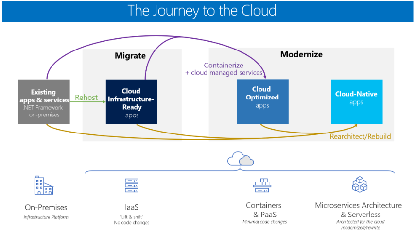

# Candidate Apps for Cloud Native

> *******************************************************
>>> Closely review: https://www.ibm.com/cloud/learn/cloud-native

Look at the apps in your portfolio. How many of them qualify for a cloud-native architecture? All of them? Perhaps some?

Applying a cost/benefit analysis, there's a good chance that most wouldn't support the hefty price tag required to be cloud native. The cost of being cloud native would far exceed the business value of the application.

What type of application might be a candidate for cloud native?

- A large, strategic enterprise system that needs to constantly evolve business capabilities/features

- An application that requires a high release velocity - with high confidence

- A system with where individual features must release without a full redeployment of the entire system

- An application developed by teams with expertise in different technology stacks able to manage deployments autonomously

- An application with components that must scale independently

Then there's legacy systems. While we'd all like to build new applications, we're often responsible for modernizing legacy workloads that are critical to the business. Over time, a legacy application could be decomposed into microservices, containerized, and ultimately "replatformed" into a cloud-native architecture.  

The free Microsoft e-book [Modernize existing .NET applications with Azure cloud and Windows Containers](https://dotnet.microsoft.com/download/thank-you/modernizing-existing-net-apps-ebook) features guidance for migrating on-premises workloads into cloud. Figure 1-8 shows that there isn't a single, one-size-fits-all strategy.

**Figure 1-8**. Strategies for migrating legacy workloads

Monolithic apps that are non-critical largely benefit from a quick lift-and-shift ([Cloud Infrastructure-Ready](https://docs.microsoft.com/dotnet/standard/modernize-with-azure-and-containers/lift-and-shift-existing-apps-azure-iaas)) migration. Here, the on-premises workload is rehosted to a cloud-based VM, without changes. This approach uses the [IaaS (Infrastructure as a Service) model](https://azure.microsoft.com/overview/what-is-iaas/). Azure includes several tools such as ([Azure Migrate](https://aka.ms/azuremigrate), [Azure Site Recovery](https://azure.microsoft.com/services/site-recovery/), and [Azure Database Migration Service](https://azure.microsoft.com/campaigns/database-migration/)) to make such a move easier.

Monolithic apps that are critical to the business oftentimes benefit from an enhanced lift-and-shift (*Cloud Optimized*) migration. This approach includes deployment optimizations that enable key cloud services - without changing the core architecture of the application. For example, you might [containerize](https://docs.microsoft.com/virtualization/windowscontainers/about/) the application and deploy it to a container orchestrator, like [Azure Kubernetes Services](https://azure.microsoft.com/services/kubernetes-service/), discussed later in this book. Once in the cloud, the application could consume other cloud services such as databases, message queues, monitoring, and distributed caching.

Finally, monolithic apps that perform strategic enterprise functions might best benefit from a *Cloud-Native* approach, the subject of this book. This approach provides agility and velocity. But, it comes at a cost of replatforming, rearchitecting, and rewriting code.

If you and your team believe a cloud-native approach is appropriate, it behooves you to rationalize the decision with your organization. What exactly is the business problem that a cloud- native approach will solve? How would it align with business needs?

- Rapid releases of features with increased confidence?

- Fine-grained scalability - more efficient usage of resources?

- Improved system resiliency?

- Improved system performance?

- More visibility into operations?

- Blend development platforms and data stores to arrive at the best tool for the job?

- Future-proof application investment?

The right migration strategy depends on the organizational priorities and the systems you're targeting. In many cases, it may be more cost effective to cloud-optimize a monolithic application or add coarse-grained services to an N-Tier app. In these cases, you can still make full use of cloud PaaS capabilities like the ones offered by Azure App Service.

## Summary

In this chapter, we introduced cloud-native computing. We provided a definition along with the key characteristics of cloud-native applications. We looked the types of applications that might justify this investment and effort.

### References

- [Cloud Native Computing Foundation](https://www.cncf.io/)

- [.NET Microservices: Architecture for Containerized .NET applications](https://dotnet.microsoft.com/download/thank-you/microservices-architecture-ebook)

- [Modernize existing .NET applications with Azure cloud and Windows Containers](https://dotnet.microsoft.com/download/thank-you/modernizing-existing-net-apps-ebook)

- [Cloud Native Patterns by Cornelia Davis](https://www.manning.com/books/cloud-native-patterns)

- [Beyond the Twelve-Factor Application](https://content.pivotal.io/blog/beyond-the-twelve-factor-app)

- [What is Infrastructure as Code](https://docs.microsoft.com/azure/devops/learn/what-is-infrastructure-as-code)

- [Uber Engineering’s Micro Deploy: Deploying Daily with Confidence](https://eng.uber.com/micro-deploy/)

- [How Netflix Deploys Code](https://www.infoq.com/news/2013/06/netflix/)

- [Overload Control for Scaling WeChat Microservices](https://www.cs.columbia.edu/~ruigu/papers/socc18-final100.pdf)

>[!div class="step-by-step"]
>[Previous](definition.md)
>[Next](scale-dotnet-applications.md) <!-- Next Chapter -->
